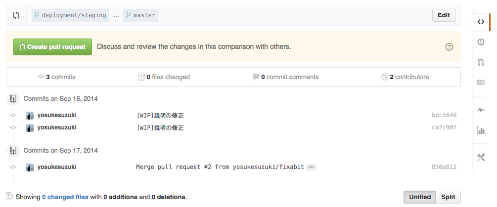
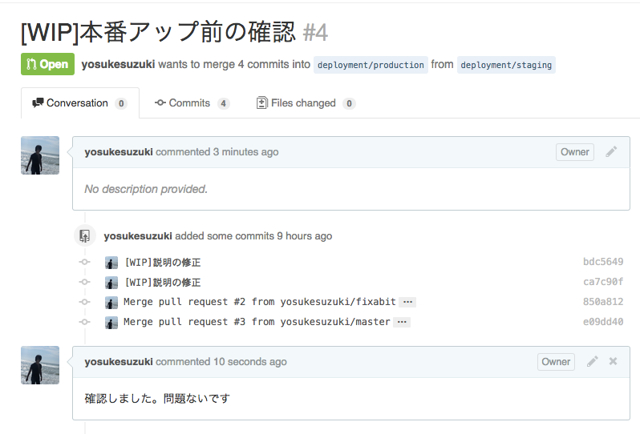
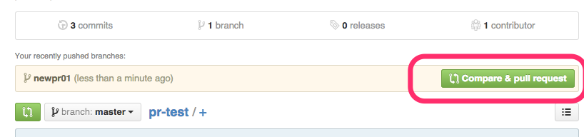
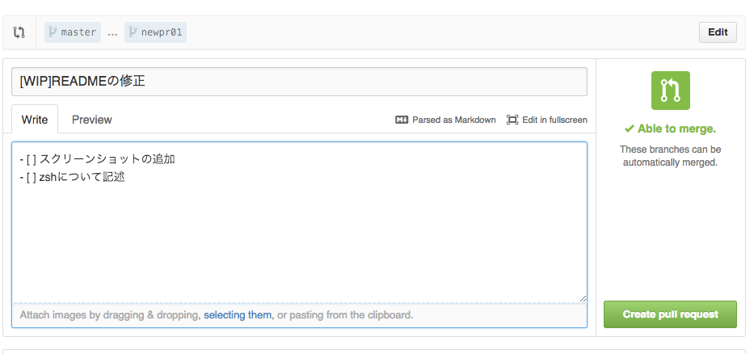
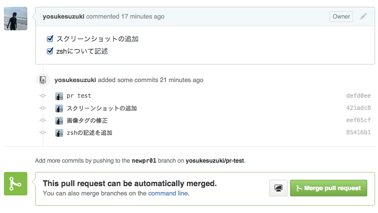

GithubおよびPull Requestについて
================================

# git/githubのメリット
- 分散型のアーキテクチャー
- pull-request型開発
- 他サービスとの連携が可能
  - テスト自動化（circle ciとか）
  - deploy自動化（capistranoとか）

# ブランチ構成
- masterブランチ
  - 開発していく上でのメーンのブランチ
  - ここからブランチを切って新しい変更を加える
- deployment/staging
  - ステージングサーバーにあがっているソースコード
  - masterからpull-requestを送ってマージする

- deployment/production
  - 本番サーバーにあがっているコード
  - deployment/stagingからpull-requestを送ってマージする


# pull-request型開発
## 1. コード変更の際にmasterブランチから新しいブランチを切る
```
# git checkout -b newpr01
```
## 2. 空でコミット& push する
```
# git commit --allow-empty
# git push origin newpr01
```
## 3. 新しいpull-requestを作る
githubの画面からpull-requestを出すもしくはhub(brew install hub)コマンドから
```
# hub pull-request
```

## 4. pull-requestにタスクを書く
```
- [ ] スクリーンショットを追加
- [ ] テストコードを書く
```

## 5. 何か変更を加えてコミット
```
# git add 対象のファイル
# git commit -m "コミットのメッセージ"
```
もしくは以下にすると変更した管理下のファイルをすべてコミットできる
```
# git commit -a
```
## 7. コミット→pushの繰り返し
必要であれば、他の開発者とやり取りしながら

## 8. マージする


# gitignoreを使う
- テンポラリーなファイルを管理しないための指定
- githubで新規のリポジトリを作るときにおすすめのセットを追加できる

# shell
- zshを入れるとブランチ名の補完がきく
- oh-my-zshがおすすめ設定

# testの自動実行
- Circle CIを利用できるように契約済
- circle.ymlをリポジトリに置いておくと自動実行

# ドキュメントはどうする？
- wikiとかREADME.mdに書く
- もしくはbacklogとかでファイル管理
